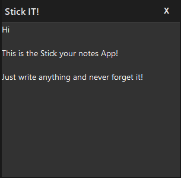

#  StickNote Windows App
**Stick the note to your screen!**

A lightweight sticky notes app for your device. StickNote lets you create always-on-top notes that stay visible while you work, with a modern dark UI and smooth functionality.

---

## Current Features

- Always-on-top sticky notes
- Draggable custom title bar
- Dark theme with padding for a clean look
- Opacity fades when the app loses focus
- Modern font and layout for easy readability

## Upcoming Features

- Triple-click to unlock editing (prevents accidental edits)
- Resizable windows
- Save the notes feature
- Multiple themes options

---

## App UI

 

---

## Installation

1. Make sure you have **Java 8+** installed on your Windows machine.
2. Download the latest `StickNote.jar` from the [releases page](https://github.com/arthsaAr/StickNote/releases/tag/v1.0.0).
3. Double-click the `StickNote.jar` to run the app.

---

## Building from Source

1. Clone the repository:

```bash
https://github.com/arthsaAr/StickNote.git
```

2. Compile
To compile the app:

```
ant compile
```

3. Run
To Run the app:

```
ant run
```
